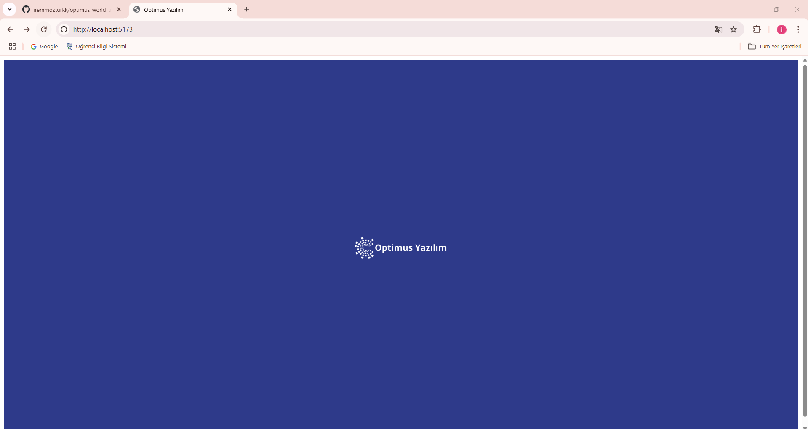
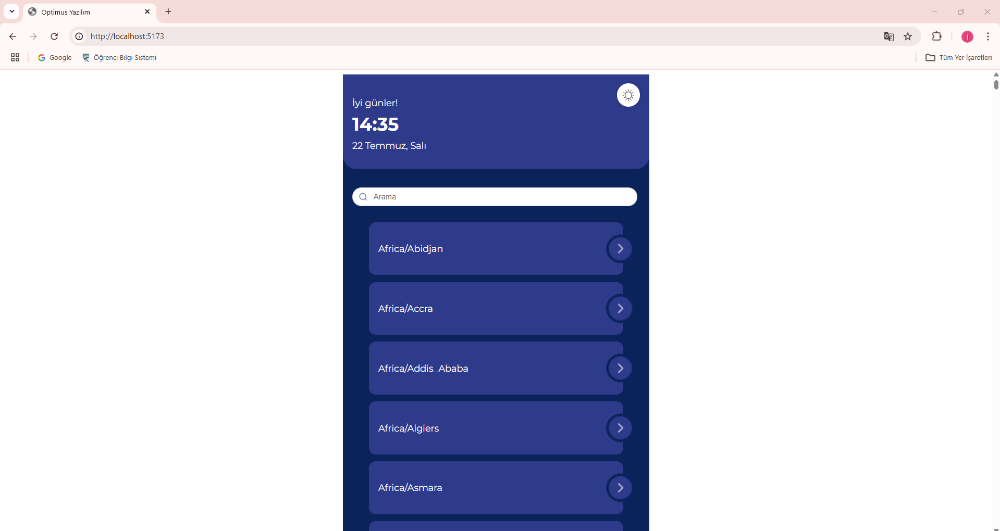
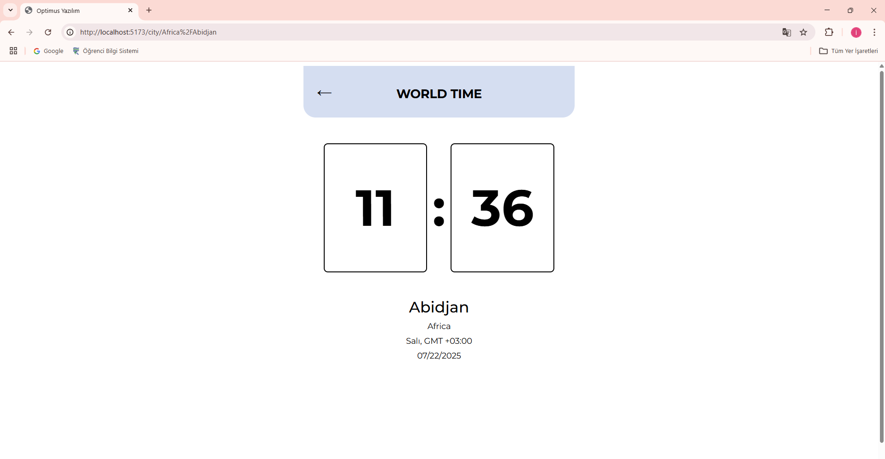
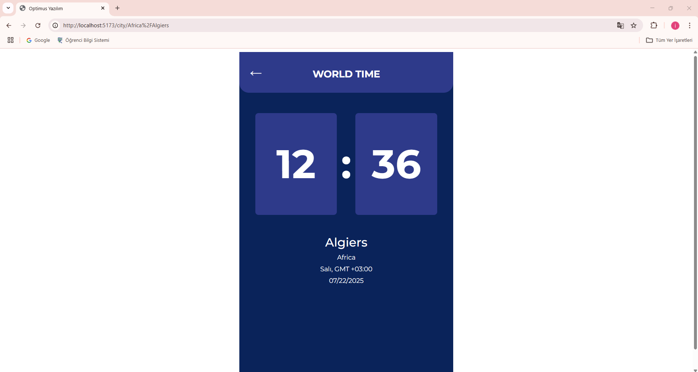

# Optimus World Time

**Optimus World Time**, dünya üzerindeki farklı şehirlerin zaman dilimlerini ve mevcut saatlerini gerçek zamanlı olarak görüntüleyen bir web uygulamasıdır.

## 🚀 Özellikler

- 🌐 Tüm dünya zaman dilimlerini listeler.
- 🔎 Zaman dilimleri arasında arama yapabilirsiniz.
- 🕒 Seçilen şehrin mevcut saatini canlı olarak gösterir.
- 🎨 Koyu ve açık tema desteği.
- ⏱️ Saat bilgisi saniye saniye güncellenir.
- 📱 Duyarlı (responsive) tasarım.
- 🧭 Splash ekran ve şehir detayları.

## 🛠️ Kullanılan Teknolojiler

- **React** — Kullanıcı arayüzü için.
- **React Router** — Sayfalar arasında geçiş için.
- **React Query (Tanstack Query)** — API isteklerini yönetmek ve önbellekleme için.
- **Emotion** — CSS-in-JS ile stillendirme için.
- **Day.js** — Tarih ve saat işlemleri için.
- **TypeScript** — Tip güvenliği için.
- **Context API & Hooks** — Global state yönetimi için.
- **Vite** — Hızlı geliştirme ve build aracı.

## 📂 Proje Yapısı
``` 
optimus-world-time/

├── src/                        # Tüm kaynak kod burada
│
│   ├── api/                    # API istekleri
│   │   └── timeApi.ts          # getTime, getTimezones gibi fonksiyonlar
│
│   ├── assets/                 # 🖼Görseller & ikonlar
│   │   ├── arrow.png
│   │   ├── header_dark.png
│   │   ├── header_light.png
│   │   ├── moon.png
│   │   └── sunny.png
│
│   ├── components/            # Küçük UI bileşenleri
│   │   ├── Clock.tsx
│   │   └── ThemeToggle.tsx
│
│   ├── contexts/              # Context API ile tema & ayar yönetimi
│   │   └── ConfigContext.tsx
│
│   ├── pages/                 # Sayfalar
│   │   ├── Home.tsx
│   │   ├── Home.styles.ts     # Emotion ile Home stilleri
│   │   ├── CityDetail.tsx
│   │   ├── CityDetail.styles.ts
│   │   └── SplashScreen.tsx  
│
│   ├── styles/                # Ortak tema & stil tanımları 
│   ├── App.tsx                # Uygulamanın kökü, router, context burada başlar
│   ├── main.tsx               # Vite + React uygulamasının giriş noktası
│
├── package.json               # Bağımlılıklar & komutlar
├── README.md                  # Proje açıklaması

``` 

## 📦 Kurulum

### Gereksinimler
- Node.js >= 16.x
- npm >= 7.x

### Adımlar
1️⃣ Projeyi klonlayın:
```bash
git clone <repo-url>
cd optimus-world-time
```

2️⃣ Bağımlılıkları yükleyin:
```bash
npm install
```

3️⃣ Geliştirme sunucusunu başlatın:
```bash
npm run dev
```

## 🧰 API Referansı

### Kullanılabilir Zaman Dilimlerini Al
`GET https://timeapi.io/api/TimeZone/AvailableTimeZones`
Yanıt:  
```json
["Europe/Istanbul", "Europe/London", ...]
```

### Seçilen Zaman Diliminde Saati Al
`GET https://timeapi.io/api/Time/current/zone?timeZone={timezone}`
Yanıt Örneği:  
```json
{
  "year": 2023,
  "month": 5,
  "day": 22,
  "hour": 14,
  "minute": 30,
  "seconds": 45,
  "date": "22/05/2023",
  "time": "14:30:45",
  "timeZone": "Europe/Istanbul"
}
```

## 🪞 Bileşenler

### SplashScreen
- Açılış yükleme ekranı.


### Clock
- Mevcut saati gösterir.
- Props: `hour`, `minute`, `seconds`

### ThemeToggle
- Temalar arasında geçiş yapmak için düğme.
- `ConfigContext` ile çalışır.

### Home
- Ana sayfa: zaman dilimlerini gösterir.
### 🌑 Koyu Tema - Ana Sayfa


### ☀️ Açık Tema - Ana Sayfa


### CityDetail
- Seçilen şehir hakkında detaylı bilgi.
### ☀️ Açık Tema - Şehir Saati


### 🌑 Koyu Tema - Şehir Saati



