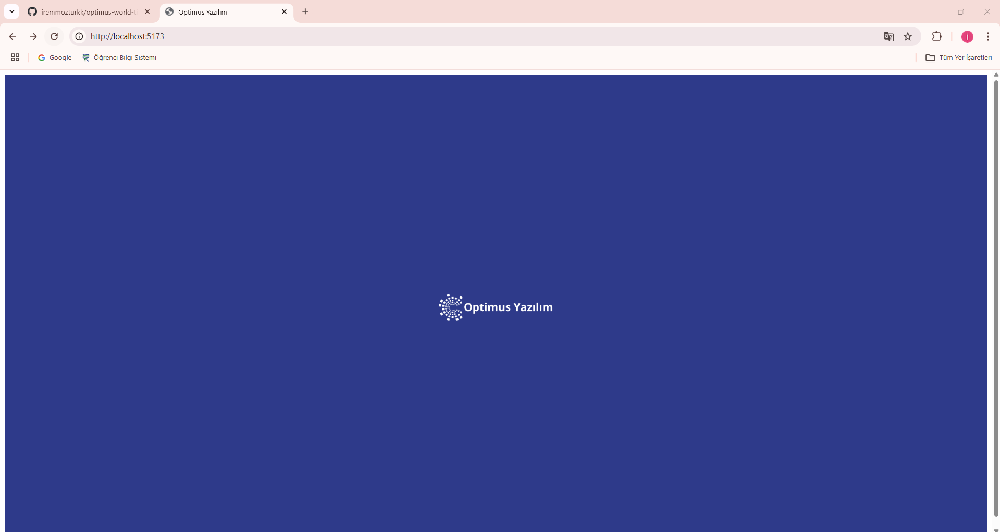
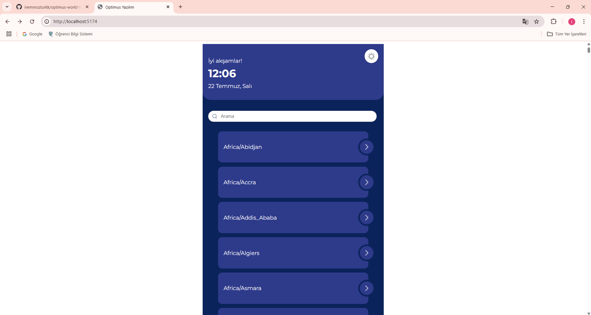
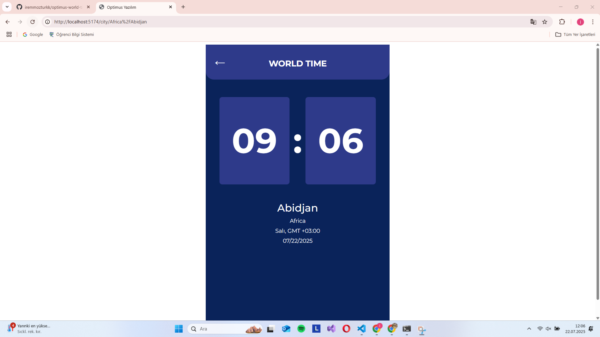
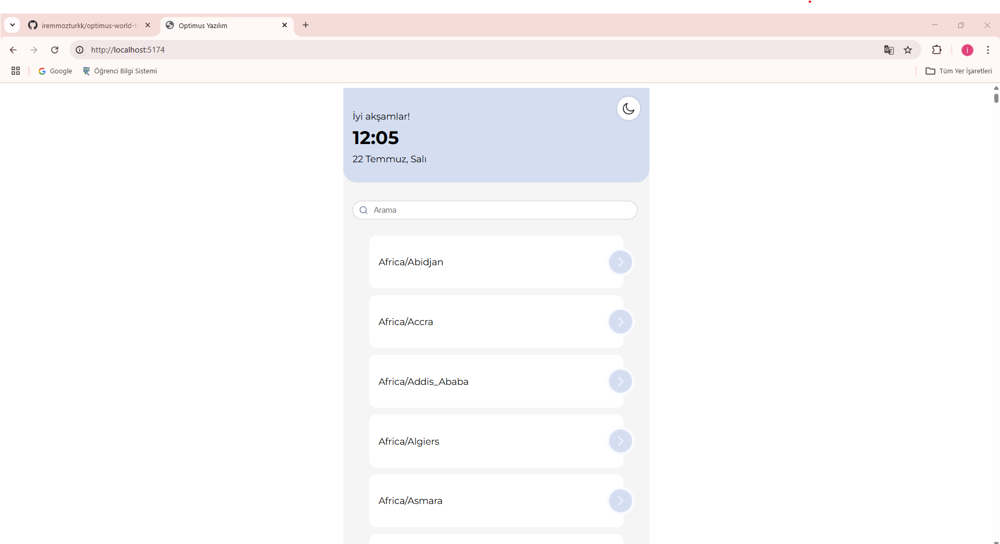
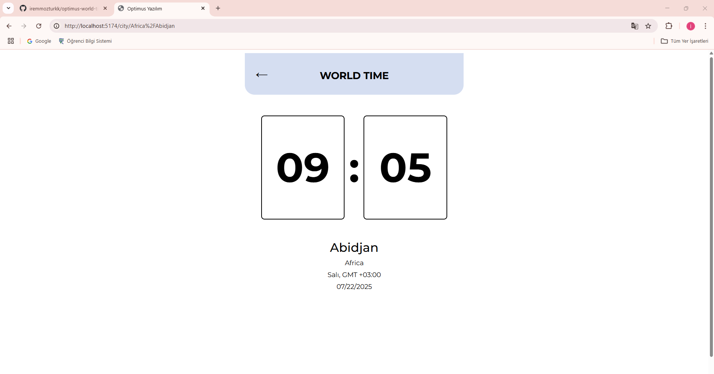

# Optimus World Time

Optimus World Time, dünya üzerindeki farklı şehirlerin zaman dilimlerini ve mevcut saatlerini gerçek zamanlı olarak görüntüleyen modern bir web uygulamasıdır. Kullanıcı dostu bir arayüz, canlı saat güncellemeleri, tema değiştirme ve arama özellikleriyle birlikte gelir.

## 🚀 Özellikler

- 🌐 Tüm dünya zaman dilimlerini listeler.
- 🔎 Zaman dilimleri arasında arama yapabilirsiniz.
- 🕒 Seçilen şehrin mevcut saatini canlı olarak gösterir.
- 🎨 Koyu ve açık tema desteği.
- ⏱️ Saat bilgisi saniye saniye güncellenir.

## 🛠️ Kullanılan Teknolojiler

- **React** — Kullanıcı arayüzü için.
- **React Router** — Sayfalar arasında geçiş için.
- **React Query (Tanstack Query)** — API isteklerini yönetmek ve önbellekleme için.
- **Emotion** — CSS-in-JS ile stillendirme için.
- **Day.js** — Tarih ve saat işlemleri için.

## 📂 Proje Yapısı

```
optimus-world-time/
├── public/
│   └── index.html
├── src/
│   ├── api/
│   │   └── timeApi.js            # Zaman ve zaman dilimi API çağrıları
│   ├── components/
│   │   └── TimezoneList.jsx      # Zaman dilimi listesi bileşeni
│   ├── contexts/
│   │   └── ConfigContext.jsx     # Tema yönetimi ve ayarlar
│   ├── pages/
│   │   └── Home.jsx              # Ana sayfa
│   ├── styles/
│   │   └── Home.styles.js        # Stiller
│   ├── App.jsx                   # Uygulama kök bileşeni
│   ├── index.js                  # Giriş noktası
├── package.json
└── README.md
```

## 📦 Kurulum

1️⃣ Projeyi klonlayın:

```bash
git clone <repo-url>
cd optimus-world-time
```

2️⃣ Bağımlılıkları yükleyin:

```bash
npm install
```

3️⃣ Uygulamayı başlatın:

```bash
npm start
```

Ardından tarayıcıda [http://localhost:3000](http://localhost:3000) adresinden uygulamayı görüntüleyebilirsiniz.

## 📸 Ekran Görüntüleri

### Ana Sayfa


### 🌑 Koyu Tema - Ana Sayfa



### 🌑 Koyu Tema - Şehir Saati




### ☀️ Açık Tema - Ana Sayfa



### ☀️ Açık Tema - Şehir Saati




